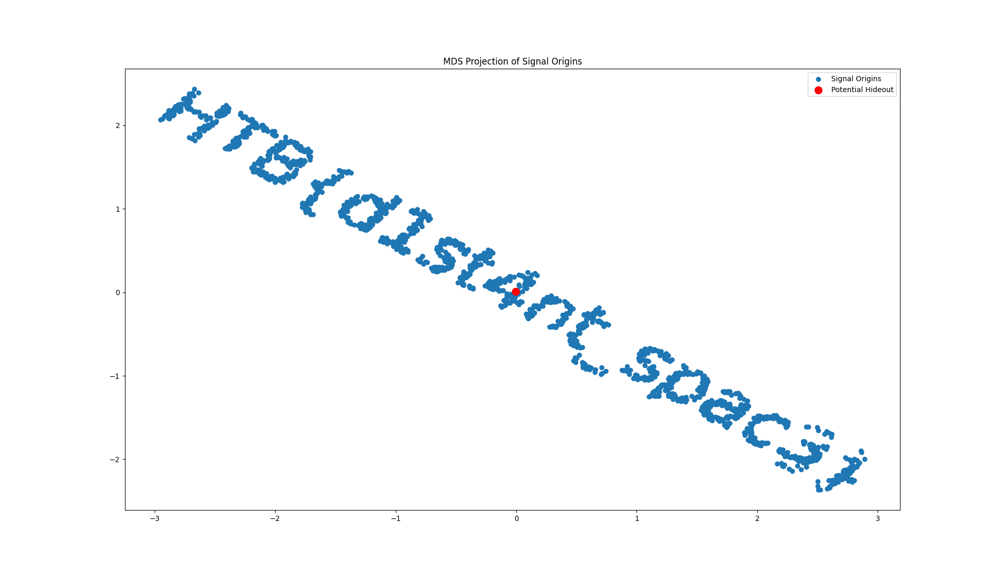

# AI SPACE

### AI SPACE – Hack The Box Challenge Walkthrough

#### Overview

**Challenge Name:** AI SPACE\
**Category:** AI/ML\
**Difficulty:** Easy\
**Objective:** Analyze a distance matrix of signal origins to locate the space hacker’s hideout—or uncover any hidden clues.

#### Introduction

In this challenge, we’re given a file named `distance_matrix.npy`, containing pairwise distances between various “signal origins.” The challenge narrative suggests that by studying these signals, we can track down an elusive space hacker. At first glance, it appears to be a straightforward AI/ML puzzle—figure out the point that’s most central, or the “hideout” coordinate.

However, as we dig deeper, we discover a twist: the actual flag isn’t just about identifying a single coordinate. Instead, the distance matrix can be used to produce a scatterplot whose shape encodes the real flag, much like a hidden “captcha.”

#### Step 1 – Recon and File Inspection

1. **Download `distance_matrix.npy`:**\
   The file is a NumPy binary containing a square matrix. Each row and column corresponds to a specific signal origin, and the value at `[i, j]` is the distance between origin `i` and origin `j`.
2.  **Confirm Matrix Shape:**\
    By loading it in Python with:

    ```python
    pythonCopyimport numpy as np

    matrix = np.load('distance_matrix.npy')
    print(matrix.shape)
    ```

    we see the size (e.g., `(N, N)`), indicating `N` signal origins.

#### Step 2 – Initial Approach: Finding the “Hideout”

A common method to find a central point in a set of distances is to sum each row. The row with the smallest total distance to all others is considered the most “central” coordinate. This might be a natural guess for the “hacker’s hideout.”

```python
pythonCopyrow_sums = matrix.sum(axis=1)
hideout_index = np.argmin(row_sums)
print("Potential hideout index:", hideout_index)
```

At this point, you might think the puzzle ends by simply identifying the row index. But the challenge’s text suggests that we “utilize advanced tracking algorithms” and “follow the digital footprint.” This hints there could be more than meets the eye.

#### Step 3 – Visualizing the Data with MDS

To dig deeper, we apply **Multi-Dimensional Scaling (MDS)**, a technique that tries to place high-dimensional data (or in this case, distances) onto a lower-dimensional space (2D) while preserving the relative distances as best as possible.

```python
pythonCopyfrom sklearn.manifold import MDS
import matplotlib.pyplot as plt

mds = MDS(n_components=2, dissimilarity='precomputed', random_state=42)
coords = mds.fit_transform(matrix)

plt.scatter(coords[:,0], coords[:,1], label='Signal Origins')
plt.title('MDS Projection of Signal Origins')
plt.legend()
plt.show()
```

#### Step 4 – The Twist: Hidden Flag in the Plot

<figure><figcaption></figcaption></figure>

When you run the above code and look at the resulting scatterplot, the points seem to form a _very specific shape_. On closer inspection, they arrange themselves to spell out:

```
HTB{d1st4nt_spac3}
```

This is our challenge flag! Rather than requiring a complex analysis to “locate the hacker,” the challenge was a ruse to get us to visualize the data. The distance matrix was deliberately constructed so that when projected into two dimensions, the points form the text of the flag.

#### Step 5 – Conclusion and Lessons Learned

1. **Never Stop at the Obvious:**\
   Although it made sense to look for a central coordinate, the real solution lay in visualizing the data. Always check for hidden patterns in AI/ML challenges—especially those from CTFs or puzzle-based platforms.
2. **MDS (and Similar Techniques) are Powerful:**\
   Multi-Dimensional Scaling, t-SNE, and UMAP are common ways to reduce high-dimensional data for visualization. Here, MDS revealed that the distance matrix was intentionally crafted.
3. **Expect the Unexpected:**\
   In challenges labeled “AI/ML,” you might anticipate typical adversarial examples or model exploitation. Sometimes, the trick is simply to decode an embedded message in the data.

#### Final Flag

The challenge’s flag, encoded in the scatterplot, is:

```
CopyHTB{d1st4nt_spac3}
```
