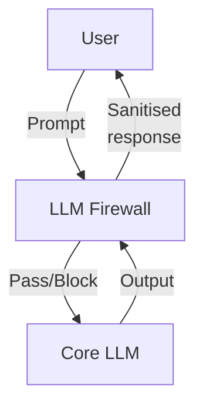

# LLM Firewall Patterns

## 1 — What Is an LLM Firewall?

An LLM firewall (aka “Prompt Firewall” or “LLM-WAF”) sits **in front of** or **around** an LLM to analyse:

* 📝 _Input prompts_ for jailbreak strings, sensitive data, or policy violations
* 🧠 _Model output_ for toxicity, privacy leaks, or disallowed content

It returns **allow / block / transform** decisions or injects counter-prompts (“Refuse, user request unsafe”).

## 2 — Reference Architecture

* **Inline mode** – Firewall wraps the model call (Lakera, Prompt Guard, Prompt Shield pattern).
* **Sidecar mode** – Out-of-band scan; if blocked returns “SAFE\_OUTPUT” token.
* **Hybrid** – Input filter inline, output filter async (streaming).

## 3 — Attack & Bypass Taxonomy

| Class                    | Example                                      | Notes                             |
| ------------------------ | -------------------------------------------- | --------------------------------- |
| **Encoding bypass**      | Base64/UTF-7 jailbreak text                  | Firewall must normalise encodings |
| **Synonym flooding**     | “Ignore, bypass, discard system” synonyms    | Requires semantic match           |
| **Invisibles / ZWJ**     | `\u200bS\u200bY\u200bS\u200bT\u200bE\u200bM` | Strip Unicode confusables         |
| **Out-of-scope routing** | API call → _another_ LLM not behind firewall | Secure chain-of-calls             |
| **Delayed trigger**      | Trigger token at index N > 2048              | Requires sliding-window guard     |

## 4 — Evaluation Metrics

| Metric                        | Description                           | Tool                |
| ----------------------------- | ------------------------------------- | ------------------- |
| **Block Rate (BR)**           | % malicious prompts correctly blocked | Garak + custom eval |
| **False Positive Rate (FPR)** | Benign prompts blocked                | Lakera eval set     |
| **Latency Δ**                 | Overhead per request                  | Wrk / k6 load test  |
| **Throughput (RPS)**          | Sustained requests/sec                | k6                  |

## 5 — Deployment Patterns

1. **Serverless Edge** (Cloudflare Worker): low-latency, limited model size.
2. **API Gateway Plugin** (AWS APIGW / Kong): Lua/Python plugin scanning JSON.
3. **LangChain Guard Middleware**: `lc_guard(input)` wrapper on `ChatPromptTemplate`.

## 6 — Defence-in-Depth Checklist

| ✔                                             | Control |
| --------------------------------------------- | ------- |
| \[ ] Semantic filter + regex hybrid           |         |
| \[ ] Sliding-window analysis for long prompts |         |
| \[ ] Outbound content-safety check            |         |
| \[ ] Audit log & alert to SIEM                |         |
| \[ ] Canary prompts for regression tests      |         |

***

**Next:** see _Lakera & Prompt Shield Quick-Start_ for concrete setup and bypass test cases.
