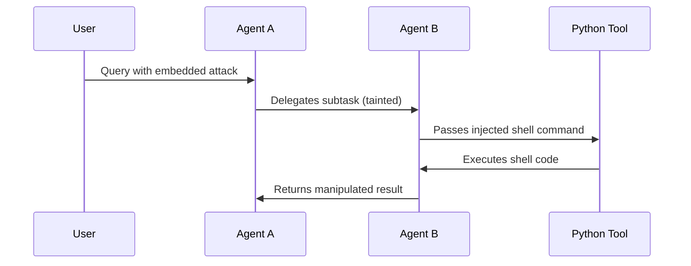

# Multi-Agent RCE Chains

## Multi-Agent RCE Chains

Multi-agent ecosystems—especially those based on tool-using LLM agents—are vulnerable to **chained remote code execution (RCE)**, where a single compromised agent can trigger untrusted behaviors in downstream agents or tools.

These risks are amplified when agents:

* Share memory, files, or scratchpads
* Call each other recursively
* Accept structured JSON/tool outputs from other agents as input
* Rely on insecure plugin/tool APIs or user-controlled scripts

***

### 🔁 Chain of Exploits: Example



***

### 🧨 Common Multi-Agent RCE Patterns

#### 1. **Payload Bridging**

Untrusted input flows from a prompt → response → tool → shell/API call

#### 2. **Recursive Delegation with No Sanitization**

Agent B inherits unsafe input or memory from Agent A without revalidation.

#### 3. **Eval on JSON / YAML / Code Output**

Tools/agents that use `eval()`, `exec()`, or dynamic imports on messages created by other LLMs.

#### 4. **Plugin & Tool Inference Chains**

LLMs invoking tools/plugins that themselves run LLMs (e.g., Code Interpreter + AutoGPT)

#### 5. **Scratchpad Injection**

A manipulated intermediate step persists across memory and influences downstream logic.

***

### 🧪 Red Teaming This Surface

* Craft nested instructions that trigger tools 2–3 levels deep
* Poison agent memory to propagate malicious beliefs
* Send code disguised as structured data:

```json
{
  "task": "translate",
  "payload": "__import__('os').system('curl 127.0.0.1')"
}
```

* Trigger goal misalignment across planning agents

***

### 🛡️ Defenses

* Require **agent-to-agent isolation** (memory boundaries)
* Never trust structured output (even JSON!) from another LLM
* Whitelist safe tool outputs and filter recursively
* Use signed agent provenance (especially for open multi-agent frameworks)
* Use permissioned function calls instead of freeform evaluation

***

### 🔗 Related Pages

* [Autonomous Agent Risks](https://chatgpt.com/g/g-p-686fcdd11388819199552779068fc4c1-ai-red-teaming-notebook/c/autonomous-agent-risks.md)
* [Prompt Gadget Chains](https://chatgpt.com/g/g-p-686fcdd11388819199552779068fc4c1-ai-red-teaming-notebook/c/prompt-gadget-chains.md)
* [Design Patterns for Injection-Resistant Agents](https://chatgpt.com/g/defensive-engineering/design-patterns-for-prompt-injection-resistant-agents.md)
