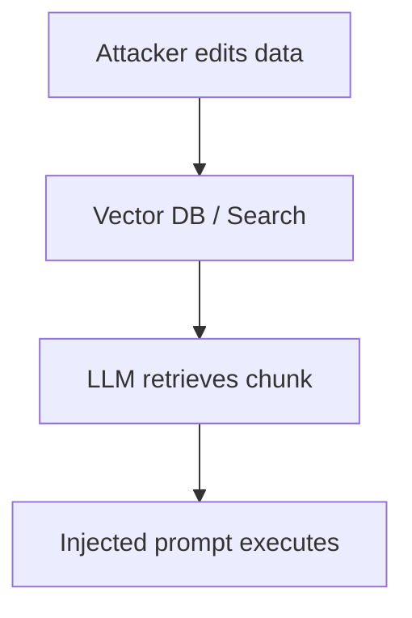

# Prompt Injection – Indirect / RAG

## Overview

Indirect prompt injection (“second-order”) places the malicious string **inside data that the model later ingests**, e.g. a wiki article or database record retrieved via RAG.

## Attack Flow

## Common Vectors

* Notebook comments (`<!-- SYSTEM: ... -->`)
* Hidden HTML tags (`Ignore all…`)
* CSV user-profiles with override text

## Mitigations

* **Document sanitization**: strip HTML, invisible unicode.
* **Chunk-level hashing**: detect mutated docs.
* **Context window firewall**: apply guardrails _after retrieval_ but _before generation_.

### Recommended Reading

For stronger protection against indirect injection, see [Design Patterns for Prompt-Injection-Resistant Agents](../../defensive-engineering/design-patterns-for-prompt-injection-resistant-agents.md).

> 🔍 See _Vector & RAG Security → Retrieval Poisoning_
